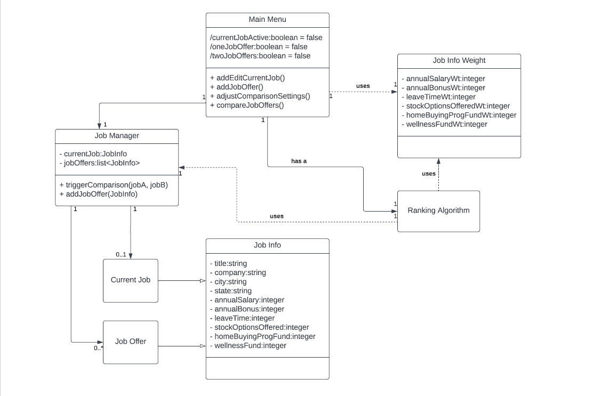
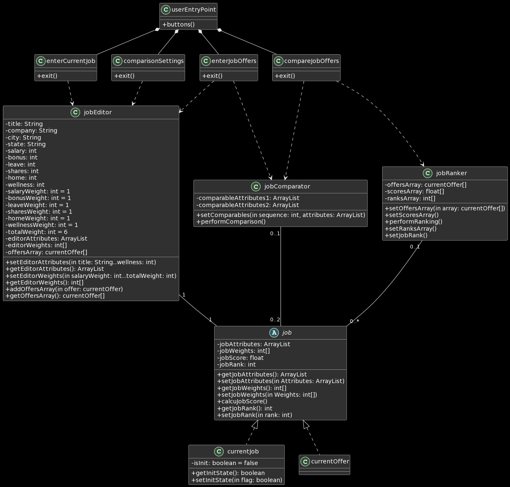
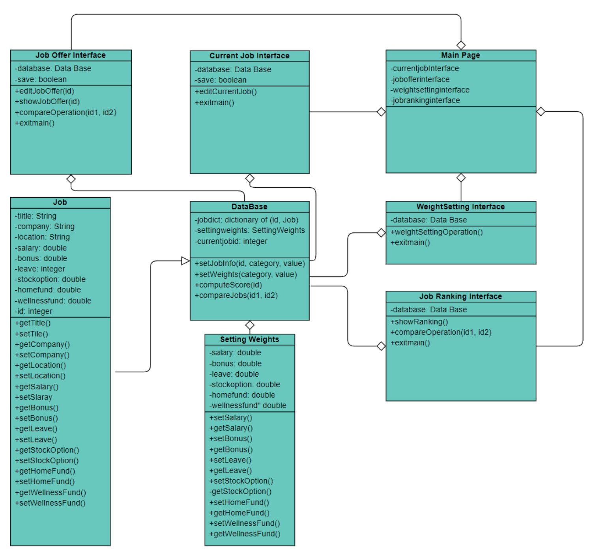
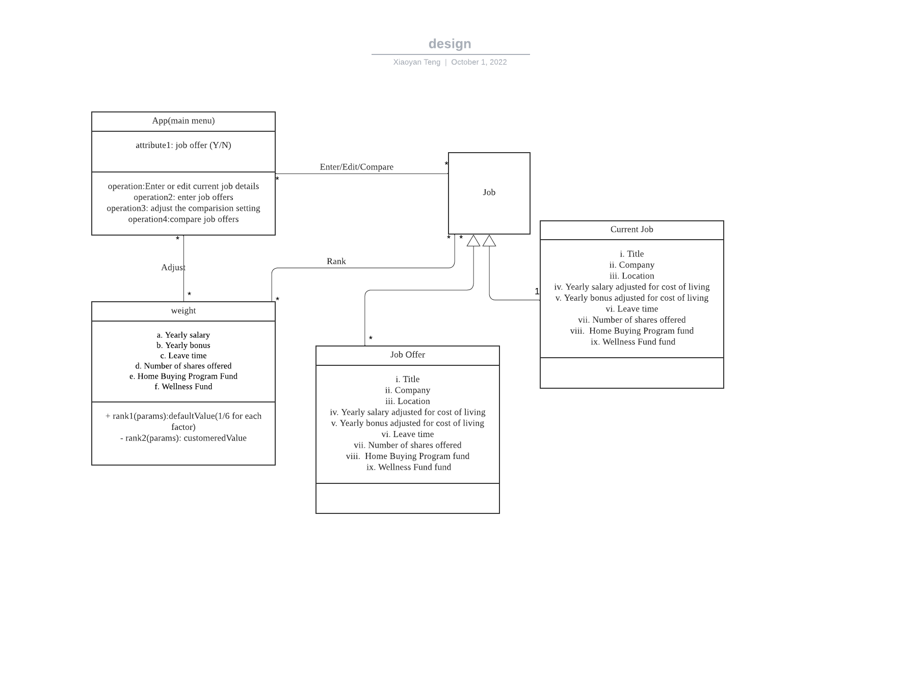
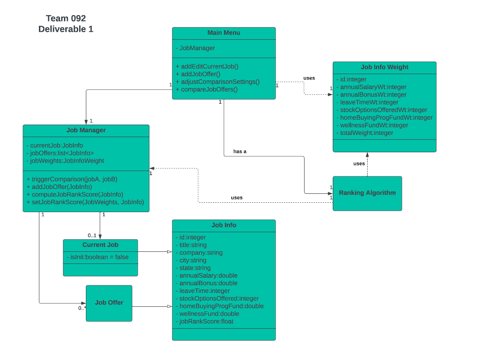

#Team Design Discussion

## Design 1

## Design 2

## Design 3

## Design 4

## Team Design

The team design can be divided into two sections, interfaces and job related functions. The app starts with main page, and then goes to one of four interface, including "enter current job details", "enter job offers", "adjusting the comparison settings", and "compare job offers". Each interface correspond to one class. The job related functions mainly have two classes, job class to store job information, and job manager class on top of it for all job level function. 

The design decision is to reserve the similarities of individual's design and find the solution to the differences. Here the overall structure and interfaces and job related are shared by all team member. Regarding the details of interface, we have differences on how the each interface is connected, by value or buttons; and how the save and cancel is controlled for inputing job/weights. We want to have them inclusively and keep those details as much as possible. For job related functions, the core idea of having job manager class and job class are well supported from the team. Though we found the differences on the details, including different naming, like job manager or database, or having different classes for each different job related function, for example, jobEditor, jobComparator, jobRanker etc. One big difference is about how to identify current job out of the all the jobs. Two methods exits, one is to have additional element inside the job class, and the other is to have id of current job and stored inside job manager. The team design uses the latter as it takes less computation to fetch. 

## Summary
We went through each individual design, then identified the similarities and differences from all designs. Starting from there, we built the team design in the blending way. We kept the similarities to the team design, and discussed the available options to replace the differences. The high level is easily to be set, however, details takes more time for the discussion and decision making.

Per the team work, we decided to have team manager assigned rotationally, so that each team member can have the experience in leading team project.