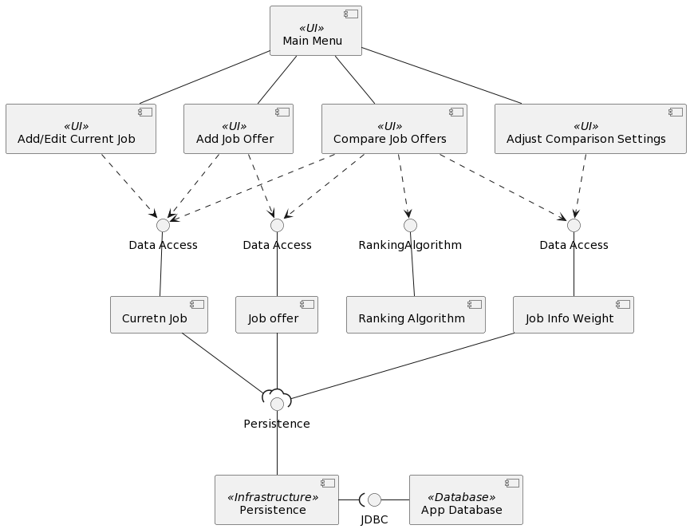
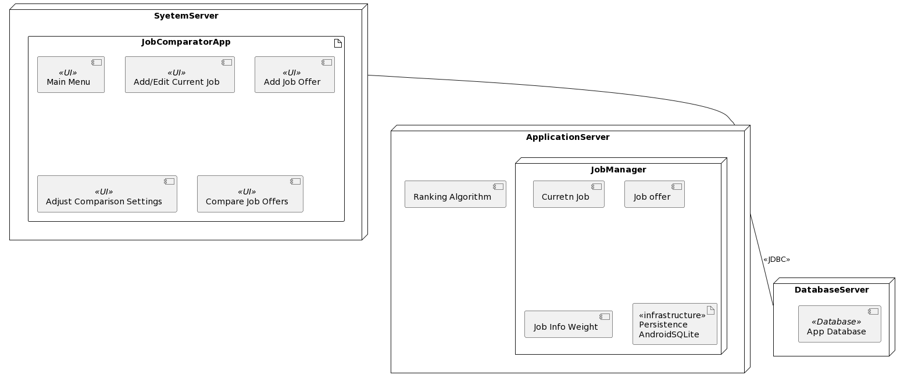
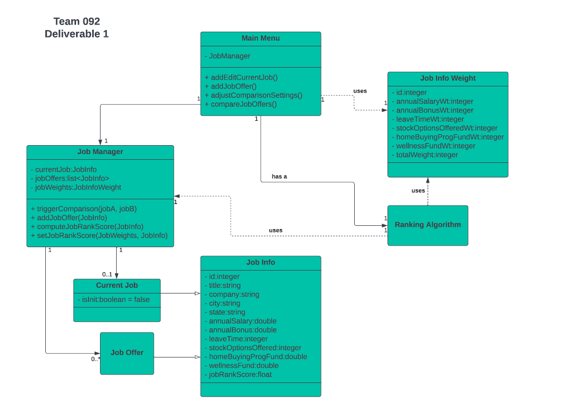
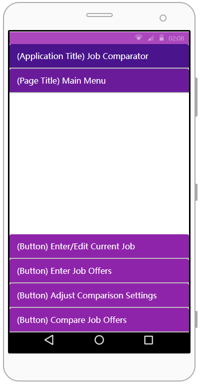
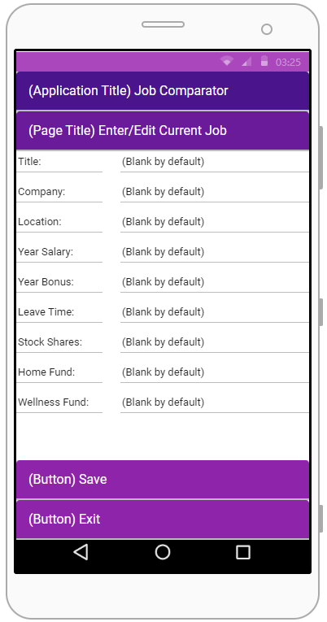
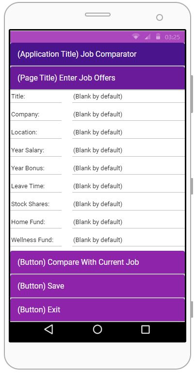
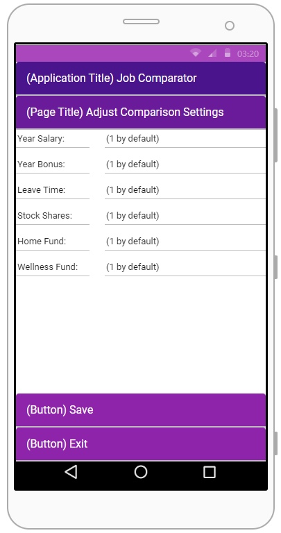
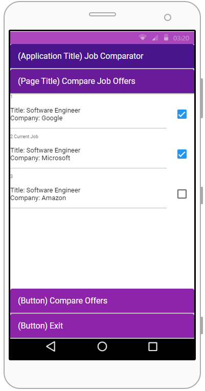
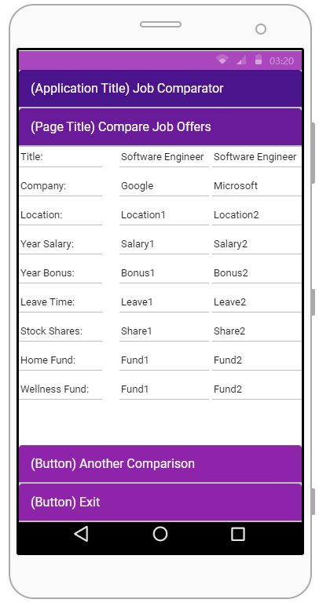

# Design Document

This document is to describe the considerations and architecture of our design in more detials, with a set of user interface designs for different scenarios.

**Author**: Hongnan Zhang

## 1 Design Considerations

This section is to state the assumptions and constraints extracted from requirement documents.

### 1.1 Assumptions

- It is a single-user application, no need of login system.
- There is a single system running the app, no communication or saving between devices is necessary.

### 1.2 Constraints

- Data and states should persist between runs. 
- If the current Job was entered and saved, the next time choosing "Enter/Edit Current Job" would show user an interface with previously saved current job information to edit further. 
- There has to be an edited current job to enable the "Compare with current job" functionality in "Enter Job Offers".
- If no weights are assigned in "Adjust Comparison Settings", all factors are considered equal. 
- The "Compare Job Offers" functionality will be enabled if there are either (1) at least two job offers, in case there is no current job, or (2) at least one job offer, in case there is a current job.

### 1.3 System Environment

- Pixel 4 XL with API level 33.
## 2 Architectural Design

This section covers the system design from application-level, including a component diagram and a deployment diagram.

### 2.1 Component Diagram
For readability, components are named similarly after their corresponding classes. 

### 2.2 Deployment Diagram

## 3 Low-Level Design
This section gives more detail on classes and their interations.
### 3.1 Class Diagram

## 4 User Interface Design
This section provides a set of user interface designs that cover different scenarios from the requirements.
### 4.1 Main Menu

### 4.2 Enter/Edit Current Job

### 4.3 Enter Job Offers

### 4.4 Adjust Comparison Settings

### 4.5 Compare Job Offers
#### 4.5.1 Rank Job Offers

#### 4.5.2 Compare Job Offers
