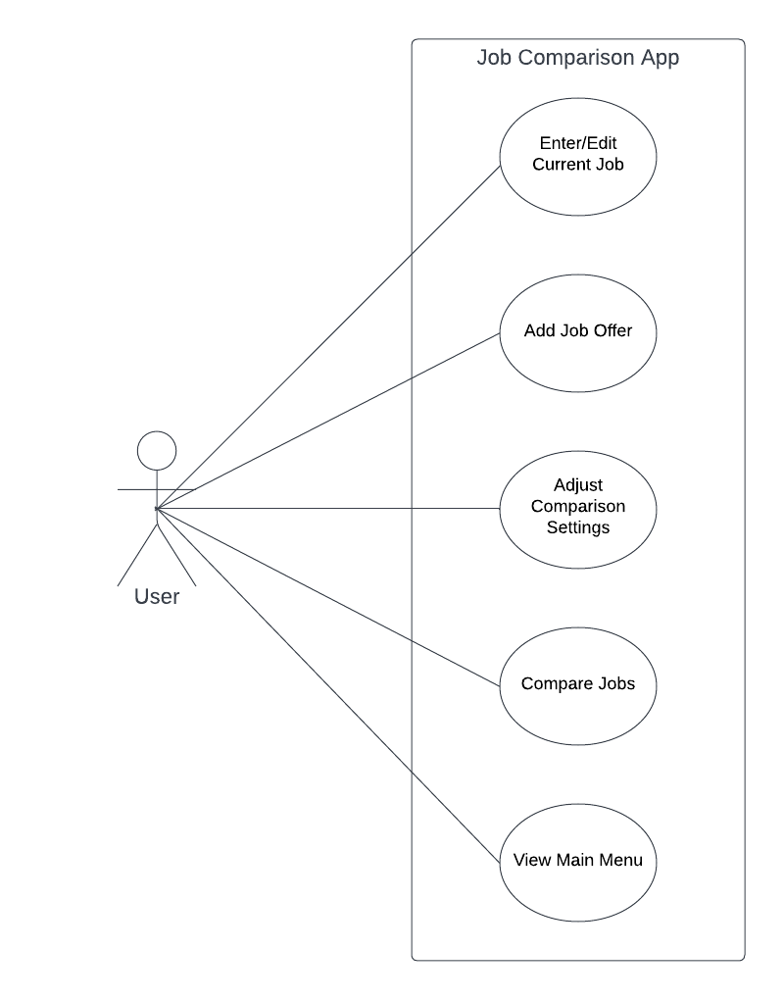

# Use Case Model

**Author**: Elisa-Michelle Rodriguez-Team 092

## 1 Use Case Diagram

## 2 Use Case Descriptions

### Enter/Edit Current Job
- Requirements: The user must be able to enter or edit their current job.
- Pre-conditions: If there is no current job saved then the option to enter their current job must be visible. If there is a current job saved then the option to edit their current job must be visible. There must be a button on the main menu which triggers this use case.
- Post-conditions: The user must have the options to either save their entry or exit which would bring them back to the main menu.
- Scenarios: 
  - Enter current job
    - fill out each job detail field
    - click save or exit
      - returns to main menu
  - Edit current job
    - modify any job detail field as needed
    - click save or exit
      - returns to main menu

### Add Job Offer
- Requirements: The user must be able to enter a single job offer at a time.
- Pre-conditions: Once saved, in order to compare the job offer to the current job, the current job must have been previously entered and saved. There must be a button on the main menu which triggers this use case.
- Post-conditions: The user must have the options to either save their entry or exit which would bring them back to the main menu.
- Scenarios:
  - Add job offer
    - fill out each job detail field
    - click save
      - enter another job offer
      - compare to current job(if present)
    - click cancel or return to main menu
      - returns to main menu

### Adjust Comparison Settings
- Requirements: The user must be able to assign integer weights to the appropriate job details specified.
- Pre-conditions: There must be a button on the main menu which triggers this use case.
- Post-conditions: The user must have the options to either save their entry or exit which would bring them back to the main menu. If no weights are assigned then inform the user all factors are considered equal.
- Scenarios:
  - Adjust comparison settings
    - enter an integer for a desired job detail field
    - click save or exit
      - returns to main menu

### Compare Jobs
- Requirements: The user must be able to select two jobs to compare.
- Pre-conditions: If the current job is present at least 1 job offer must be present to compare jobs. If no current job is present then at least 2 job offers must be present.
- Post-conditions: A list of job offers including the current job(if present) will be displayed as Title and Company ranked from best to worst according to the weights assigned in the comparison settings. Upon selecting 2 jobs to compare, a table must be shown displaying the 2 selected jobs along with the job details for each. The option to trigger another comparison or exit must be displayed to the user. 
- Scenarios:
  - Compare jobs
    - view list of all job offers and current job, if present
    - select 2 jobs to compare and click compare offers
      - click perform another comparison
        - return to the previous screen which displays all jobs to be selected for comparison
      - click exit
        - returns to main menu
    - click exit
      - returns to main menu

### View Main Menu
- Requirements: Once selected the user must be able to view the main menu.
- Pre-conditions: The user must be on a screen other than the main menu.
- Post-conditions: The options to trigger the above use cases must be visible.
- Scenarios:
  - Enter/edit current job
  - Add job offer
  - Adjust comparison settings
  - Compare jobs